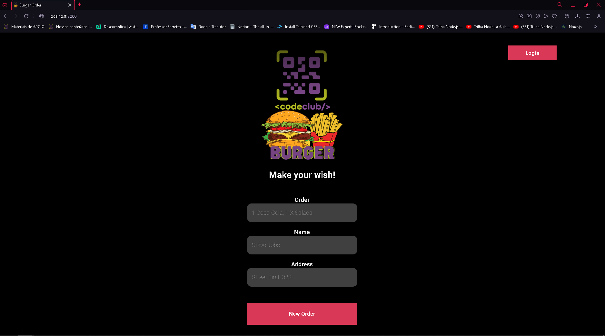

<h1 align="center">Order Burguer</h1>

<h3 align="center">
  You need to order
</h3>

## 🏠 About the project

Order Burger, uma simulação de pedidos em uma hambúrgueria fictícia. Este projeto teve início durante o curso DevClub, onde fui desafiado a desenvolver um projeto de forma independente. O design utilizado é integralmente crédito do curso, embora eu tenha acrescentado algumas personalizações para aprimorá-lo.
 

## 🖥️ Technologies

[React]  
[Node]  
[Axios]  
[Sonner]  

## Contributors

We thank the following people who contributed to this project:

<table>
  <tr>
    <td align="center">
      <a href="#">
         
        
          <b>Luan Rebuli</b>
        
      </a>
    </td>
  </tr>

## Certificates

https://app.rocketseat.com.br/certificates/3d261164-b7f5-4773-8414-72b172ad6f3c

</table>
